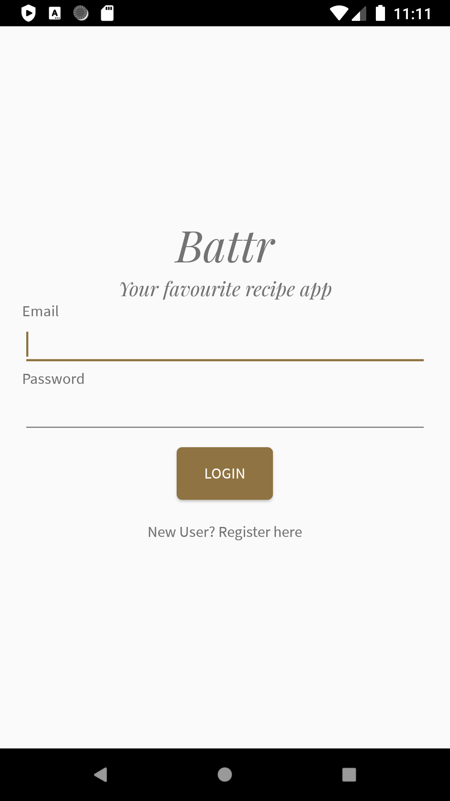
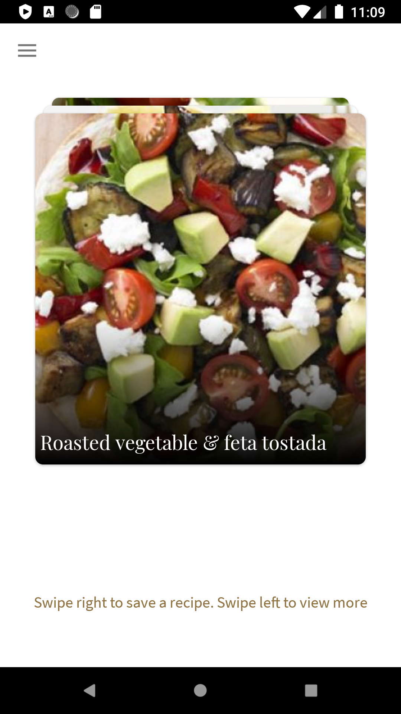
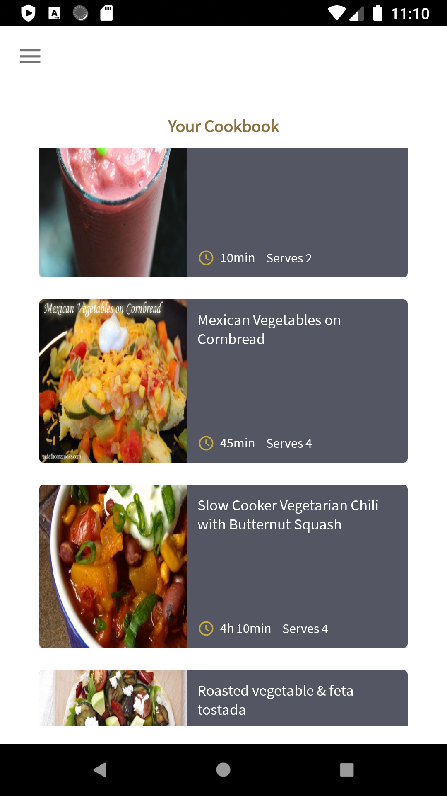

# Battr
A simple recipes app using Tinder-like swipes

## Technologies used
- Android with Java
- Firebase authentication and Firebase Firestore
- Picasso for image loading
- CardStackView for the swipe cards
- DuoNavigationDrawer for the navigation drawer
- Material design components for the cards

> Disclaimer: The recipe information is sourced from [Spoonacular](https://spoonacular.com).

## Screenshots

